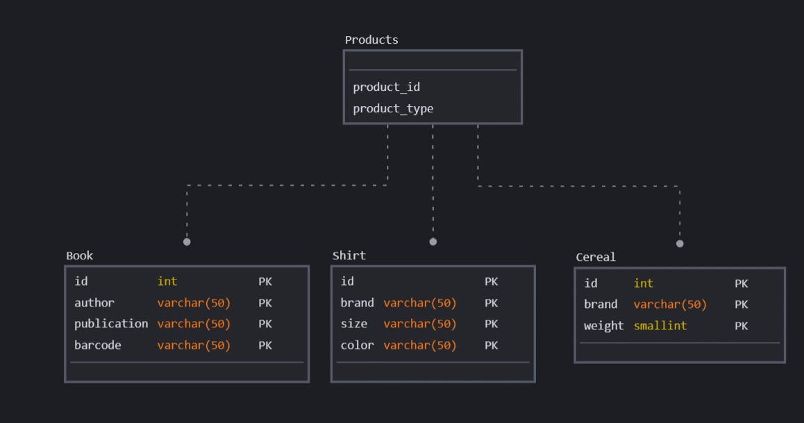

## ORM Relationship In Details

### What Are Relationships in Eloquent?
When working with tables in a relational database, we can characterize relationships as connections between tables. This helps you organize and structure data effortlessly allowing for superior readability and handling of data. There are three types of database relationships in practice:

- `one-to-one` – One record in a table is associated with one, and only one, in another table. For example, a person and a social security number.
- `one-to-many` – One record is associated with multiple records in another table. For instance, a writer and their blogs.
- `many-to-many` – Multiple records in a table are associated with multiple records in another table. Namely, students and the courses they are enrolled in.

Along with these definitions, Laravel introduces more relationships, namely:

- Has Many Through
- Polymorphic Relations
- Many-to-many Polymorphic



Database schema with three tables and a joint table representing a polymorphic relationship

### The hasOne and belongsTo are two different types of relationships in Laravel's Eloquent ORM. 

The main difference between hasOne and belongsTo lies in the placement of the foreign key and the ownership of the relationship. hasOne is used when the foreign key is stored on the table of the model declaring the relationship, while belongsTo is used when the foreign key is stored on the associated model's table.

**Note: If foregin key on table use belongTo**

If `sample_table` id store another `sampletable2` table, this time use (hasOne)

#### One To One
```
class User extends Model
{
    /**
     * Get the phone associated with the user.
     */
    public function phone(): HasOne
    {
        return $this->hasOne(Phone::class);
    }
}
```
Defining The Inverse Of The Relationship
So, we can access the Phone model from our User model. Next, let's define a relationship on the Phone model that will let us access the user that owns the phone. 
We can define the inverse of a hasOne relationship using the belongsTo method:
```
public function user(): BelongsTo
{
    return $this->belongsTo(User::class);
}
```
#### One To Many
```
class Post extends Model
{
    /**
     * Get the comments for the blog post.
     */
    public function comments(): HasMany
    {
        return $this->hasMany(Comment::class);
    }
}
```
#### One To Many (Inverse) / Belongs To

To define the inverse of a hasMany relationship, define a relationship method on the child model which calls the belongsTo method:
```
class Comment extends Model
{
    /**
     * Get the post that owns the comment.
     */
    public function post(): BelongsTo
    {
        return $this->belongsTo(Post::class);
    }
}
```
#### Has One Of Many Relationship
Since our Tenant model can be associated with many Rent models, we want to easily retrieve the latest or oldest related model of the relationships.

A convenient way of doing this is combining the hasOne and ofMany methods:
```
public function latestRent() {
    return $this->hasOne(Rent::class)->latestOfMany();
}

public function oldestRent() {
    return $this->hasOne(Rent::class)->oldestOfMany();
}
```
```
public function latestOrder(): HasOne
{
    return $this->hasOne(Order::class)->latestOfMany();
}

public function oldestOrder(): HasOne
{
    return $this->hasOne(Order::class)->oldestOfMany();
}

/**
 * Get the user's orders.
 */
public function orders(): HasMany
{
    return $this->hasMany(Order::class);
}
 
/**
 * Get the user's largest order.
 */
public function largestOrder(): HasOne
{
    return $this->orders()->one()->ofMany('price', 'max');
}
```

### Has One Through
```
class Mechanic extends Model
{
    /**
     * Get the car's owner.
     */
    public function carOwner(): HasOneThrough
    {
        return $this->hasOneThrough(Owner::class, Car::class);
    }
}
```

### Has Many Through 
```
<-----------Senario------------->
projects
    id - integer
    name - string
 
environments
    id - integer
    project_id - integer
    name - string
 
deployments
    id - integer
    environment_id - integer
    commit_hash - string
<------------------------>

```

```
class Project extends Model
{
    /**
     * Get all of the deployments for the project.
     */
    public function deployments(): HasManyThrough
    {
        return $this->hasManyThrough(Deployment::class, Environment::class);
    }
}
```
### Many to Many Relationship
The many-to-many relationship is more complicated. One good example is an employee that has multiple roles. A role can also be assigned to multiple employees. This is the basis of the many-to-many relationship.

For this, we must have the employees, roles, and role_employees tables.

Our database table structure will look like this
```
--------senario-----------------
employees
    id - integer
    name - string

roles 
    id - integer
    name - string

role_employees
    user_id - integer
    role_id - integer
```
```
<?php

namespace App\Models;
use Illuminate\Database\Eloquent\Model;

class Employee extends Model
{
    public function roles() 
    {
        return $this- >belongsToMany(Role::class);
    }
}
```
```
$employee = Employee::find(1);
$employee->roles->forEach(function($role) { // });

// OR 

$employee = Employee::find(1)->roles()->orderBy('name')->where('name', 'admin')->get();
```

[Ref](https://kinsta.com/blog/laravel-relationships/#manytomany-relationship)

